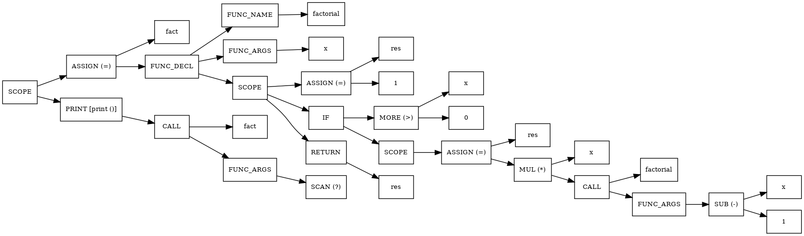

# **ParaCL ***(version 2.0)***** 

# How to build a project
```
  $ mkdir build
  $ cd build
  $ cmake ..
  $ make
```
``` 
 Make sure that you have already installed Bison and Flex!
```
---
### This is the ~~first~~ second version of ParaCL-interpreter that can execute some basic constructions and functions on C-like language. There are some examples of programs which were implemented on ParaCL like fibonacci-numbers (itterative and recursive) and factorial-calculating (the same).   
---
# Example of AST 
```cpp
// ====================================== 
// Factorial program (itterative)
// ======================================

max_border  = ?;
res         = 1;
curIt       = 1;

while (curIt <= max_border) {

    res     = res * curIt;
    curIt   = curIt + 1;

}

print (res);
```
<p align = "center">

</p>

```cpp
// ====================================== 
// Factorial program (recursive)
// ======================================
fact = func(x) : factorial {
    res = 1;
    
    if (x > 0) {

        res = x * factorial(x - 1); 
    }
    
    res;
}

print fact(?);
```

<p align = "center">

</p>

---

[ExactlyWb](https://github.com/Exactlywb)

[PozhiloyPumba](https://github.com/PozhiloyPumba)

[kolobabka](https://github.com/kolobabka)