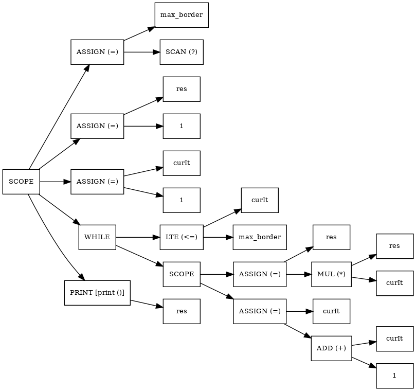

# **ParaCL-interpreter ***(version 1.0)***** 
===================================================================================================
# How to build a project
```
  $ mkdir build
  $ cd build
  $ cmake ..
  $ make
```
## **Make sure that you have already installed Bison and Flex!**
---
### This is the first version of ParaCL-interpreter that can execute some basic statements on C-like language. There are some examples of programs which were implemented on ParaCL like fibonacci-numbers and factorial-calculating.   
---
# Example of AST 
```cpp
// DblCmpTeam
// Frolov, Belov, Ivanov
// github.com/Exactlywb/VladimirovsCourse
// ====================================== 
// Factorial program 
// ======================================

max_border  = ?;
res         = 1;
curIt       = 1;

while (curIt <= max_border) {

    res     = res * curIt;
    curIt   = curIt + 1;

}

print (res);
```
<p align = "center">

</p>

---
===================================================================================================

[ExactlyWb](https://github.com/Exactlywb)

[PozhiloyPumba](https://github.com/PozhiloyPumba)

[kolobabka](https://github.com/kolobabka)