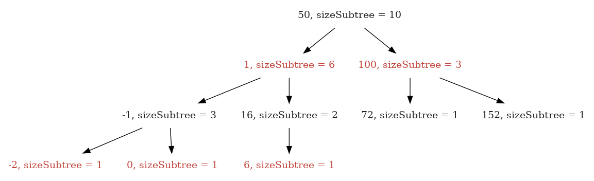
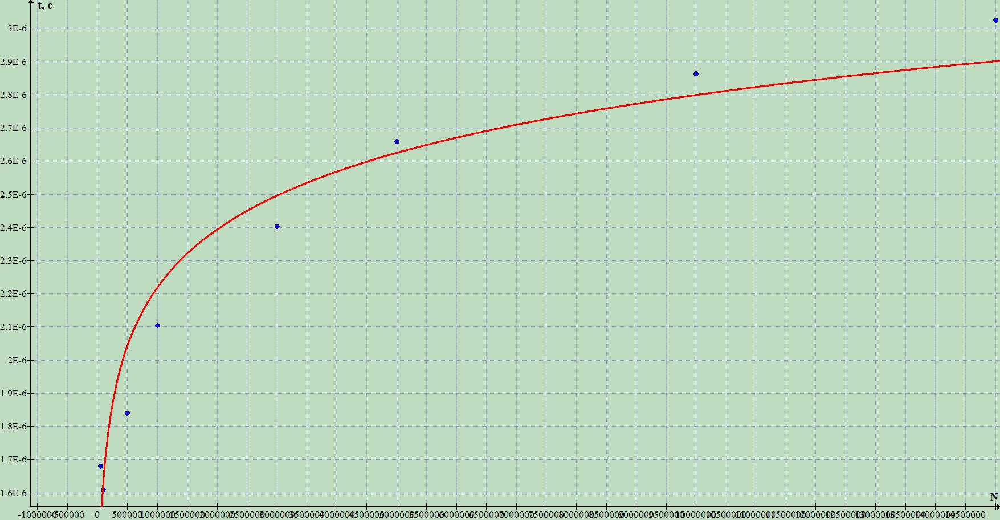

# TREE
==================================================================
# How to build 
```
  $ mkdir build
  $ cd build
  $ cmake ..
  $ make
```
## If you have some troubles with building the project, try to install GoogleTests:

## Compiler settings:)
```
  $ g++ -Wall -Wextra -Wpedantic -Wsign-promo 
    -Wsign-conversion -Wdouble-promotion
    -Wfloat-equal -Wbool-compire -Wdiv-by-zero
    -O2 
```
---
---
### In a folder 'build' an executiable file 'tree' and  test-file 'test_tree' will appear
---
# Input data: 
* **k** N --- push an integer number N
* **m** N --- query for searching N-th order statistic
* **n** N --- amount of elements in the tree less than N
### ***example:*** 
**INPUT:** ---> <<k 8 k 2 k -1 m 1 m 2 n 3>> ||^_^|| **OUTPUT:** ---> <<-1 2 2>>

--- 

## Steps of implementation:
* Build a Red-Black tree with an addition filed named **'subtreeSize'** --- the size of subtree of the node
* Input queries from the ***stdin***
* Execute every query, remember it in a vector and print the   result to ***stdout***  
---
## Some words about Red-Black-Tree
### A Red-Black Tree is a tree with the next invariant:
* Every node is either <H style="background:#FFFFFF"> <span style="color:#FF0000">Red</span></H> or <H style="background:#FFFFFF"> <span style="color:#000000">Black</span></H>
* Root is <H style="background:#FFFFFF"> <span style="color:#000000">Black</span></H>
* If node is <H style="background:#FFFFFF"> <span style="color:#FF0000">Red</span></H> then its childs are <H style="background:#FFFFFF"> <span style="color:#000000">Black</span></H>
* For each node all simple paths to leaves-descendants include the same amount of <H style="background:#FFFFFF"> <span style="color:#000000">Black</span></H> nodes
### The example of Red-Black Tree: 

# Algorithmic efficiency
## Every operation of a Red-Black tree isn't worth than LogN:
### Insert ---> LogN
### Search ---> LogN
### Search k-th order statistic ---> LogN
### Calculate an amount of elements in the tree less than N ---> LogN

---
## All in all, it is better than using std::set
---
# Useful materials: 
*  **Introduction to Algorithms** by Thomas H. Cormen [2013]

===================================================================================================
# Implemented by Frolov, Ivanov and Belov