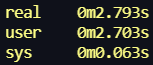

# How to build a project
```
  $ mkdir build
  $ cd build
  $ cmake ..
  $ make
```
## Compiler settings:
```
  $ g++ -Wall -Wextra -O2
```
---
---
### In a folder 'build' a file 'triangles' will appear executing a programm
---
---
# Some words about the algorithm
### The task requires to output the numbers of intersected triangles recieved from stdin. To do it faster then with naive implementation with O(n^2) we use octree to divide space into 8 parts. Then we find intersections between triangles in the same part or between triangles lied in the several parts at the same time. 
---
## Steps of implementation:
* Input triangles from **stdin**
* Build the octree dependent on the maximum absolute value of a coordinate of one of triangle
* Check the intersection of one-part triangles and triangles lied in the same branch of the tree
* Return the result
---
# Some words about geometric part of this task
## steps of determining the intersection: 

---
# Algorithmic efficiency
## In the worst way (when almost all the triangles lies nearby each other) we have O(n^2). In case of uniform distribution of triangles in space this is asymptotically O(NlogN) 
---
## 9216 the same triangles: 

---
---
## 9216 almost uniform distributed triangles (it's wrong assumption, but ok :)): 

---
---
## All in all, it is better than the naive implementation
---
---
# Some examples of out triangles in Vulcan API:
## An alone triangle

## Some intersected triangles

## Intersected and not intersected ones

## About 10000 random triangles 

# Useful materials: 
* https://habr.com/ru/post/334990/ ---> the article about the Octree
*  **Geometric Tools for Computer Graphics** by Philip Schneider and David Eberly [2003]

===================================================================================================
# Implemented by Frolov, Ivanov and Belov