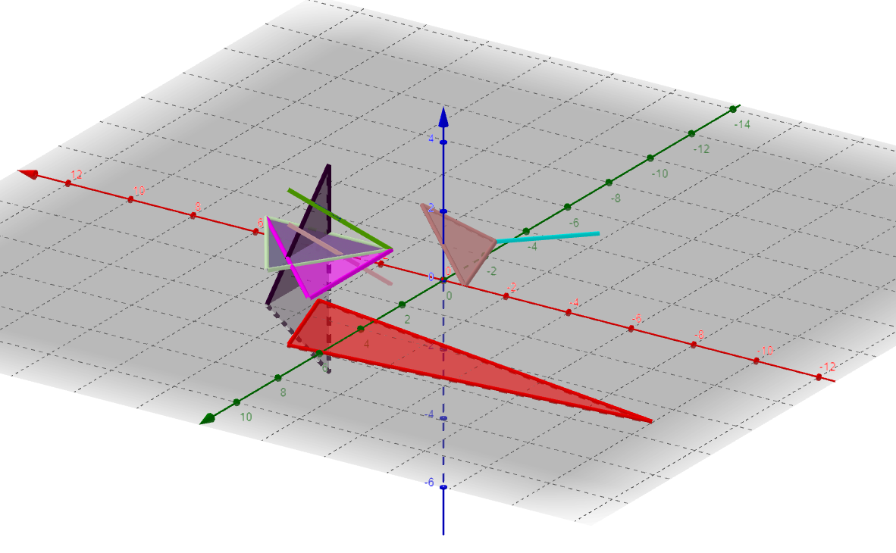

# Some words about the tests

## We checked our small tests in GeoGebra 3D Calculator. You can see example of it in the pictire.

|  |
| :--: |
| *This picture illustrates octreeTests/tests/test4.txt (red triangle has 11 number (starting from 0) and it is one of all doesn't intersect)* |
